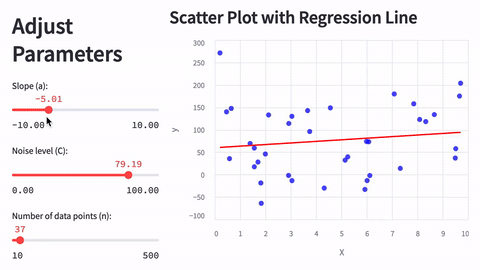
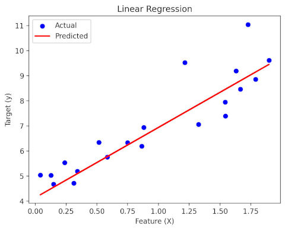
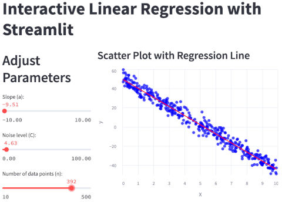
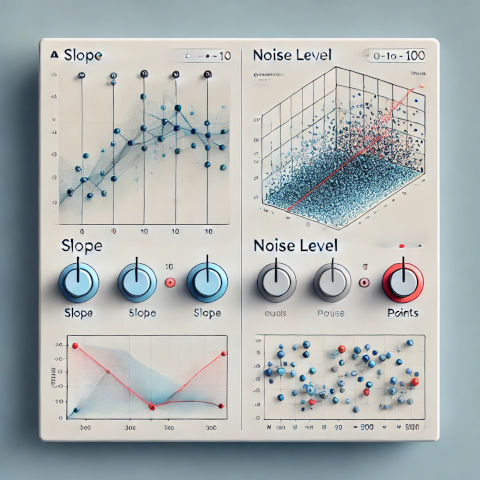

## AIoT Applications and Data Analysis

Course ID: 7716, CS, NCHU  
Sep., 2024

### HW1 - Linear Regression


#### Library Dependencies
Install Python libraries
```bash
python -m pip install numpy scikit-learn matplotlib streamlit pandas
```

#### Running
```bash
python -m streamlit run main.py
```

#### Exercise
##### :speech_balloon: Step 1
###### :bulb: *Prompt*
Here is a Python program to solve linear regression using the `scikit-learn` library:

######  *ChatGPT:*
Here is a Python program to solve linear regression using the `scikit-learn` library:


```python 
# Import necessary libraries
import numpy as np
import matplotlib.pyplot as plt
from sklearn.linear_model import LinearRegression
from sklearn.model_selection import train_test_split
from sklearn.metrics import mean_squared_error

# Generate some random data for demonstration
# X: Feature (independent variable)
# y: Target (dependent variable)
np.random.seed(42)
X = 2 * np.random.rand(100, 1)
y = 4 + 3 * X + np.random.randn(100, 1)

# Split the data into training and testing sets
X_train, X_test, y_train, y_test = train_test_split(X, y, test_size=0.2, random_state=42)

# Create a Linear Regression model
model = LinearRegression()

# Train the model using the training data
model.fit(X_train, y_train)

# Make predictions on the testing set
y_pred = model.predict(X_test)

# Evaluate the model
mse = mean_squared_error(y_test, y_pred)
rmse = np.sqrt(mse)

# Print the model parameters and performance
print(f"Intercept: {model.intercept_}")
print(f"Coefficient: {model.coef_}")
print(f"Root Mean Squared Error: {rmse}")

# Plot the results
plt.scatter(X_test, y_test, color="blue", label="Actual")
plt.plot(X_test, y_pred, color="red", label="Predicted", linewidth=2)
plt.xlabel("Feature (X)")
plt.ylabel("Target (y)")
plt.title("Linear Regression")
plt.legend()
plt.show()
```

**Explanation:**
1. **Data Generation:** The data is randomly generated for illustration purposes with a linear relation: `y = 4 + 3 * X + noise`.
1. **Train-Test Split:** The dataset is split into training and testing sets using `train_test_split`.
1. **Linear Model:** A linear regression model is created using `LinearRegression()`.
1. Model Training: The model is trained with the training data (`X_train`, `y_train`).
1. **Model Evaluation:** The model's performance is evaluated using the root mean squared error (RMSE).
1. **Plotting:** The predicted values vs actual values are plotted to visualize the fit.

You can replace the random data with your own dataset if needed.

:eyes: ***Dump***
```bash
python main.py
```


---

##### :speech_balloon: Step 2
###### :bulb: *Prompt:*
convert the code to streamlit without matplotlib.

######  *ChatGPT:*
To convert the given code to a Streamlit app without using `matplotlib` for visualization, we can use `streamlit`'s built-in charting functionality. Here's the modified version of the code:

```python
# Import necessary libraries
import numpy as np
import pandas as pd
import streamlit as st
from sklearn.linear_model import LinearRegression
from sklearn.model_selection import train_test_split
from sklearn.metrics import mean_squared_error

# Set up the Streamlit app
st.title("Linear Regression with scikit-learn")

# Generate some random data for demonstration
# X: Feature (independent variable)
# y: Target (dependent variable)
np.random.seed(42)
X = 2 * np.random.rand(100, 1)
y = 4 + 3 * X + np.random.randn(100, 1)

# Split the data into training and testing sets
X_train, X_test, y_train, y_test = train_test_split(X, y, test_size=0.2, random_state=42)

# Create a Linear Regression model
model = LinearRegression()

# Train the model using the training data
model.fit(X_train, y_train)

# Make predictions on the testing set
y_pred = model.predict(X_test)

# Evaluate the model
mse = mean_squared_error(y_test, y_pred)
rmse = np.sqrt(mse)

# Display model parameters and performance
st.write(f"**Intercept:** {model.intercept_[0]}")
st.write(f"**Coefficient:** {model.coef_[0][0]}")
st.write(f"**Root Mean Squared Error (RMSE):** {rmse}")

# Convert test data and predictions to a DataFrame for visualization
test_results = pd.DataFrame({
    'X_test': X_test.flatten(),
    'y_test': y_test.flatten(),
    'y_pred': y_pred.flatten()
})

# Display the actual vs predicted results
st.write("### Actual vs Predicted Results")
st.dataframe(test_results)

# Plot the results using Streamlit's line chart
st.write("### Visualization of Test Data vs Predictions")
st.line_chart(test_results[['X_test', 'y_test']], width=700, height=400)
st.line_chart(test_results[['X_test', 'y_pred']], width=700, height=400)
```

**Key Changes:**
**Streamlit Integration:**
 - Used `st.title()`,`st.write()`, and `st.dataframe()` to display text and data.
 - Streamlit's line_chart() is used instead of `matplotlib` to plot the actual vs predicted values.

**Data Visualization:**
 - The test data (`X_test` and `y_test`) and predicted values (`y_pred`) are stored in a Pandas DataFrame for easier visualization with Streamlit's charting features.

**How to Run:**
1. Install Streamlit if you haven't already:
```bash
pip install streamlit
```
2. Save the code to a file (e.g., `linear_regression_app.py`).
3. Run the Streamlit app:
```bash
streamlit run linear_regression_app.py
```
This app will display the linear regression results and two line charts showing the test data and predictions.

---

##### :speech_balloon: Step 3
###### :bulb: *Prompt:*
1. combine all figures in one changes to the scatter plot.
2. show the regression line in red.
3. modify a*X+50+C*np.random.randn(n,1) in variable y, 
   - the a is -10 to 10, 
   - c is 0 to 100,
   - n is number of points 10 to 500,
   - and then allow user to input a, c as slider.
4. move the sliders area to left, place the figure to right.

######  *ChatGPT:*
To move the sliders to the left and the plot to the right in the Streamlit app, we can use Streamlit's layout functionalities, specifically `st.sidebar` to display the sliders in the sidebar, and the figure will be placed to the right in the main area. Below is the full solution:

**Updated Code:**
```python
import numpy as np
import streamlit as st
from sklearn.linear_model import LinearRegression
import pandas as pd
import altair as alt

# Streamlit app starts here
st.title("Interactive Linear Regression with Streamlit")

# Create two columns: left for sliders, right for scatter plot
col1, col2 = st.columns([1, 2])

# In the first column (left), add the sliders for user input
with col1:
    st.header("Adjust Parameters")
    
    # 1. Add sliders for user inputs (a, c, and n)
    a = st.slider("Slope (a):", -10.0, 10.0, 2.5)  # Slope of the line
    c = st.slider("Noise level (C):", 0.0, 100.0, 2.0)  # Level of noise
    n = st.slider("Number of data points (n):", 10, 500, 100)  # Number of data points

# In the second column (right), show the scatter plot with regression line
with col2:
    # 2. Generate random linear data based on user input
    np.random.seed(42)
    X = np.random.rand(n, 1) * 10  # n random points between 0 and 10
    y = a * X + 50 + c * np.random.randn(n, 1)  # y = a * X + 50 + noise

    # 3. Convert to DataFrame for visualization
    data = pd.DataFrame(np.hstack((X, y)), columns=['X', 'y'])

    # 4. Fit the Linear Regression model
    model = LinearRegression()
    model.fit(X, y)

    # 5. Create the regression line using the full range of X
    X_range = np.linspace(X.min(), X.max(), 100).reshape(-1, 1)  # Full range of X values for plotting the regression line
    y_range_pred = model.predict(X_range)  # Corresponding predictions (y values)

    # 6. Prepare data for the plot
    # Data for scatter plot
    scatter_data = pd.DataFrame({
        'X': X.flatten(), 
        'y': y.flatten()
    })

    # Data for regression line
    regression_line = pd.DataFrame({
        'X': X_range.flatten(),
        'y': y_range_pred.flatten()
    })

    # 7. Create Altair chart: Scatter plot with regression line
    st.write("### Scatter Plot with Regression Line")

    # Scatter plot for data points
    scatter_chart = alt.Chart(scatter_data).mark_circle(color='blue', size=60).encode(
        x='X',
        y='y'
    )

    # Line plot for regression line
    regression_chart = alt.Chart(regression_line).mark_line(color='red', size=2).encode(
        x='X',
        y='y'
    )

    # Combine both charts: scatter + regression line
    combined_chart = scatter_chart + regression_chart

    # Display the combined chart in Streamlit
    st.altair_chart(combined_chart, use_container_width=True)

```
**Key Modifications:**
1. **Sliders in Sidebar:**
   - `st.sidebar.slider()` is used to move the sliders for `a`, `c`, and `n` to the left-hand side (the sidebar).
1. **Plot on the Right:**
   - The main plot appears in the main area on the right of the screen, while the sidebar is reserved for the controls.
1. **Same Plot:**
    - The actual data points are displayed as blue scatter points.
    - The predicted data points are displayed as green scatter points.
    - The regression line is shown in red.

**How to Run:**
1. Install the necessary libraries if you haven't already:
```bash
pip install streamlit scikit-learn numpy pandas
```

2. Save the code to a file, e.g., `linear_regression_app.py`.

3. Run the Streamlit app:

```bash
streamlit run linear_regression_app.py
```

Result:
The left sidebar contains the sliders for adjusting the slope (`a`), noise (`c`), and number of data points (`n`).
The right side displays the actual vs predicted scatter plot and the red regression line.

:eyes: ***Dump***
```bash
python -m streamlit run main.py
```


---

##### :speech_balloon: Step 4
###### :bulb: *Prompt:*
show me the prompt

######  *ChatGPT:*
Here’s the breakdown of the key prompt for generating the plot:

- **Scatter plot of random data points in blue.**
- **Regression line in red.**
- **Sliders** to adjust parameters `a` (slope), `c` (noise level), and `n` (number of points).
- **Left side** for user input via sliders.
- **Right side** for the combined scatter plot with regression line.

**Prompt:**
**Scatter plot showing random points along a linear equation with a red regression line.** The chart should update dynamically based on user input from sliders for the slope (`a` from -10 to 10), noise (`c` from 0 to 100), and number of points (`n` from 10 to 500). The chart consists of two areas: on the left, user inputs are controlled by sliders, and on the right, the scatter plot (blue) and regression line (red) are displayed.


Here is the generated image showing the two-column layout with sliders on the left and the scatter plot with the red regression line on the right, matching the prompt.