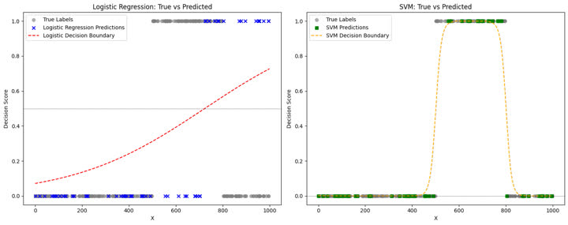
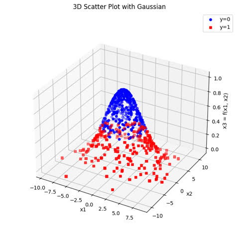

## AIoT Applications and Data Analysis

Course ID: 7716, CS, NCHU  
Nov., 2024

### HW3 - Support Vector Machine


#### Library Dependencies
Install Python libraries
```bash
python -m pip install numpy scikit-learn matplotlib streamlit
```

#### Running
```bash
python main.py
```

```bash
streamlit run main2.py
```

#### Exercise
##### HW3.1 - Using SVM to compare with logistic regression in one-dimensional 
##### :speech_balloon: Step 1
###### :bulb: *Prompt*
generate best prompt for you to perform the following task:

1. Genrate 300 random variable x(i) in 0 to 1000
2. y(i) = 1 if 500 < x(i) < 800, else y(i) = 0.
3. write logistic regression and output predict result y1, svm output predict result y2.
4. draw x, y and x, y1 in one figure, and draw x, y and x,y2 in another.

######  *ChatGPT:*
Here’s a well-structured prompt for me to generate a solution for your task:

**Task:** Implement and visualize a classification task using Logistic Regression and SVM for a 1D boundary.

**Instructions:**

**1. Data Generation:**
  - Generate 300 random integer values \(X(i)\)in the range [0, 1000].
  - Create binary labels \(Y(i)\) such that:
    * \(Y(i) = 1\) if \(500 < X(i) < 800\),
    * \(Y(i) = 0\) otherwise.

**2. Data Splitting:**
  - Split the dataset into training and testing sets using train_test_split with a test size of 30%.

**3. Model Training:**
  - Train a Logistic Regression model using the training set.
  - Train a Support Vector Machine (SVM) model using the training set.

**4. Prediction:**
  - Use the Logistic Regression model to predict the labels for the test set \(Y1\).
  - Use the SVM model to predict the labels for the test set \(Y2\).

**5. Visualization:**
  - Create a single figure with two subplots:
    * Figure 1: Plot the ground truth \((X, Y)\) alongside the Logistic Regression predictions \((X_{test},Y1\)).
    * Figure 2: Plot the ground truth \((X, Y)\) alongside the SVM \((X _{test},Y2)\).
  - Use distinct colors and markers to differentiate between the true labels and predictions.

**6. Expected Output:**
  - A figure with two subplots showing the  performance of Logistic Regression and SVM on the test set.
---

##### :speech_balloon: Step 2
###### :bulb: *Prompt*
use the prompt to implement a system to perform logistic regression and SVM on a set of 300 randomly generated variables, and visualize the results, please.

######  *ChatGPT:*
```python
import numpy as np
import matplotlib.pyplot as plt
from sklearn.model_selection import train_test_split
from sklearn.linear_model import LogisticRegression
from sklearn.svm import SVC

# Generate 300 random variables X(i) in the range [0, 1000]
np.random.seed(42)
X = np.random.randint(0, 1001, 300)

# Create binary classification labels Y(i)
y = np.where((X > 500) & (X < 800), 1, 0)

# Splitting the data into training and testing sets
X_train, X_test, y_train, y_test = train_test_split(X.reshape(-1, 1), y, test_size=0.2, random_state=42)

# Step 2: Train Logistic Regression model
logistic_model = LogisticRegression()
logistic_model.fit(X_train, y_train)
y_pred_logistic = logistic_model.predict(X_test)

# Step 3: Train SVM model
svm_model = SVC(probability=True)
svm_model.fit(X_train, y_train)
y_pred_svm = svm_model.predict(X_test)

# Plotting the results in two separate figures
plt.figure(figsize=(15, 6))

# Figure 1: X, Y, and X, Y1
plt.subplot(1, 2, 1)
plt.scatter(X, y, color='gray', label='True Labels')
plt.scatter(X_test, y_pred_logistic, color='blue', marker='x', label='Logistic Regression')
plt.xlabel('X')
plt.ylabel('Predictions')
plt.title('Logistic Regression: True vs Predicted')
plt.legend()

# Figure 2: X, Y, and X, Y2
plt.subplot(1, 2, 2)
plt.scatter(X, y, color='gray', label='True Labels')
plt.scatter(X_test, y_pred_svm, color='green', marker='s', label='SVM')
plt.xlabel('X')
plt.ylabel('Predictions')
plt.title('SVM: True vs Predicted')
plt.legend()

plt.tight_layout()
plt.show()
```

:eyes: ***Dump***


---

##### :speech_balloon: Step 2
###### :bulb: *Prompt*
add the decision hyperplane for each algorithm, please.

######  *ChatGPT:*
```python
import numpy as np
import matplotlib.pyplot as plt
from sklearn.model_selection import train_test_split
from sklearn.linear_model import LogisticRegression
from sklearn.svm import SVC

# Generate 300 random variables X(i) in the range [0, 1000]
np.random.seed(42)
X = np.random.randint(0, 1000, 300)

# Create binary classification labels Y(i)
y = np.where((X > 500) & (X < 800), 1, 0)

# Splitting the data into training and testing sets
X_train, X_test, y_train, y_test = train_test_split(X.reshape(-1, 1), y, test_size=0.2, random_state=42)

# Step 2: Train Logistic Regression model
logistic_model = LogisticRegression()
logistic_model.fit(X_train, y_train)
y_pred_logistic = logistic_model.predict(X_test)

# Step 3: Train SVM model
svm_model = SVC(probability=True)
svm_model.fit(X_train, y_train)
y_pred_svm = svm_model.predict(X_test)

# Create a grid for plotting decision boundaries
X_grid = np.linspace(0, 1000, 300).reshape(-1, 1)

# Get decision boundary values
logistic_probs = logistic_model.predict_proba(X_grid)[:, 1]  # Probabilities for Logistic Regression
X_grid = np.linspace(0, 1000, 300).reshape(-1, 1)
svm_decision = svm_model.predict_proba(X_grid)[:, 1]     # Decision scores for SVM

# Plotting the results in two separate figures
plt.figure(figsize=(15, 6))

# Figure 1: X, Y, and Logistic Regression Decision Boundary
plt.subplot(1, 2, 1)
plt.scatter(X, y, color='gray', label='True Labels', alpha=0.6)
plt.scatter(X_test, y_pred_logistic, color='blue', marker='x', label='Logistic Regression Predictions')
plt.plot(X_grid, logistic_probs, color='red', linestyle='--', label='Logistic Decision Boundary')
plt.axhline(0.5, color='black', linestyle=':', linewidth=0.8)  # Logistic threshold
plt.xlabel('X')
plt.ylabel('Decision Score')
plt.title('Logistic Regression: True vs Predicted')
plt.legend()

# Figure 2: X, Y, and SVM Decision Boundary
plt.subplot(1, 2, 2)
plt.scatter(X, y, color='gray', label='True Labels', alpha=0.6)
plt.scatter(X_test, y_pred_svm, color='green', marker='s', label='SVM Predictions')
plt.plot(X_grid, svm_decision, color='orange', linestyle='--', label='SVM Decision Boundary')
plt.axhline(0, color='black', linestyle=':', linewidth=0.8)  # SVM threshold
plt.xlabel('X')
plt.ylabel('Decision Score')
plt.title('SVM: True vs Predicted')
plt.legend()

plt.tight_layout()
plt.show()
```

:eyes: ***Dump***



---

##### :speech_balloon: Step 3
###### :bulb: *Prompt*
1. Genrate 300 random variable x(i) in 0 to 1000
2. y(i) = 1 if 500 < x(i) < 800, else y(i) = 0.
3. write logistic regression and output predict result y1, svm output predict result y2.
4. draw x, y and x, y1 in one figure, and draw x, y and x,y2 in another.
5. reorder the y_test, y_pred_logistic sequence by the value of x_test and draw y_test, y_pred_logistic and overlay the logistic regression predictions.
6. reorder the y_test, y_pred_svm sequence by the value of x_test and draw y_test, y_pred_svm and overlay a line plot of the svm predictions.

######  *ChatGPT:*
Here's the updated code to perform these steps:
```python
import numpy as np
import matplotlib.pyplot as plt
from sklearn.model_selection import train_test_split
from sklearn.linear_model import LogisticRegression
from sklearn.svm import SVC

# Generate 300 random variables X(i) in the range [0, 1000]
np.random.seed(42)
X = np.random.randint(0, 1000, 300)

# Create binary classification labels Y(i)
y = np.where((X > 500) & (X < 800), 1, 0)

# Splitting the data into training and testing sets
X_train, X_test, y_train, y_test = train_test_split(X.reshape(-1, 1), y, test_size=0.2, random_state=42)

# Step 2: Train Logistic Regression model
logistic_model = LogisticRegression()
logistic_model.fit(X_train, y_train)
y_pred_logistic = logistic_model.predict(X_test);

# Step 3: Train SVM model
svm_model = SVC(probability=True)
svm_model.fit(X_train, y_train)
y_pred_svm = svm_model.predict(X_test);

# Reorder the sequences by the value of X
sorted_idx = np.argsort(X.flatten())
X_sorted = X[sorted_idx]
y_sorted = y[sorted_idx]

sorted_idx = np.argsort(X_test.flatten())
X_test_sorted = X_test[sorted_idx]
y_test_sorted = y_test[sorted_idx]
y_pred_logistic_sorted = y_pred_logistic[sorted_idx]
y_pred_svm_sorted = y_pred_svm[sorted_idx]

# Create a grid for plotting decision boundaries
X_grid = np.linspace(0, 1000, 300).reshape(-1, 1)

# Plotting the results
plt.figure(figsize=(15, 6))

# Plot y and y_pred_logistic with Logistic Regression predictions (green line)
plt.subplot(1, 2, 1)
plt.scatter(X_sorted, y_sorted, color='gray', label='True Labels', alpha=0.6)
plt.scatter(X_test_sorted, y_pred_logistic_sorted, color='blue', marker='x', label='Logistic Regression Predictions')
plt.plot(X_test_sorted, y_pred_logistic_sorted, color='red', label='Logistic Regression Decision Boundary')
plt.axhline(0.5, color='black', linestyle=':', linewidth=0.8)  # Logistic threshold
plt.xlabel('X')
plt.ylabel('Predictions')
plt.title('Logistic Regression: True vs Predicted')
plt.legend()

# Plot y and y_pred_svm with SVM predictions (red line)
plt.subplot(1, 2, 2)
plt.scatter(X_sorted, y_sorted, color='gray', label='True Labels', alpha=0.6)
plt.scatter(X_test_sorted, y_pred_svm_sorted, color='green', marker='s', label='SVM Predictions')
plt.plot(X_test_sorted, y_pred_svm_sorted, color='orange', label='SVM Decision Boundary')
plt.axhline(0, color='black', linestyle=':', linewidth=0.8)  # SVM threshold
plt.xlabel('X')
plt.ylabel('Predictions')
plt.title('SVM: True vs Predicted')
plt.legend()

plt.tight_layout()
plt.show()
```

:eyes: ***Dump***


---

##### HW3.2 - SVM with separating hyperplane in 2D case in 3D plot
##### :speech_balloon: Step 1
###### :bulb: *Prompt*
do python to generate 600 random points centered at (0, 0) with variance 10, please.

######  *ChatGPT:*
Here's the updated code to perform these steps:

```python
import numpy as np
import matplotlib.pyplot as plt

# Parameters
num_points = 600
mean = 0
variance = 10

x1 = np.random.normal(mean, np.sqrt(variance), num_points)
x2 = np.random.normal(mean, np.sqrt(variance), num_points)

# Calculate distances from the origin
distances = np.sqrt(x1**2 + x2**2)

# Assign labels y=0 for points within distance 10, y=1 for the rest
y = np.where(distances < 10, 0, 1)

# Plot the points
plt.figure(figsize=(8, 8))
plt.scatter(x1[y==0], x2[y==0], color='blue', marker='o', label='y=0')
plt.scatter(x1[y==1], x2[y==1], color='red', marker='s', label='y=1')
plt.title('Scatter Plot with Two Classes (y=0 and y=1)')
plt.xlabel('x1')
plt.ylabel('x2')
plt.axis("equal")
plt.grid(True)
plt.legend()
plt.show()
```

**Features:**

**1. Classification of Points:**
- Points with a Euclidean distance of less than 10 are labeled as `y=0`.
- Points with a distance greater than or equal to 10 are labeled as `y=1`.

**2. Plotting:**
- Blue circles (`o`) represent `y=0` points.
- Red squares (`s`) represent `y=1` points.
- The grid and equal axis scaling ensure clarity in visualization.

**3. Clarity in Code:**
- Added explanatory comments to make the code self-explanatory.

If you'd like any further modifications or explanations, feel free to ask!

:eyes: ***Dump***


---

##### :speech_balloon: Step 2
###### :bulb: *Prompt*
change y=0 for points in distance less than 4 and y=1 for the rest.

######  *ChatGPT:*
Here's the updated code where `y=0` is assigned to points with a distance less than 4, and `y=1` for the rest:

```python
import numpy as np
import matplotlib.pyplot as plt

# Parameters
num_points = 600
mean = 0
variance = 10

x1 = np.random.normal(mean, np.sqrt(variance), num_points)
x2 = np.random.normal(mean, np.sqrt(variance), num_points)

# Calculate distances from the origin
distances = np.sqrt(x1**2 + x2**2)

# Assign labels Y=0 for points within distance 10, y=1 for the rest
y = np.where(distances < 4, 0, 1)

# Create scatter plot
plt.figure(figsize=(8, 6))
plt.scatter(x1[y==0], x2[y==0], color='blue', marker='o', label='Y=0')
plt.scatter(x1[y==1], x2[y==1], color='red', marker='s', label='Y=1')
plt.xlabel('x1')
plt.ylabel('x2')
plt.title('Scatter Plot with Two Classes (y=0 and y=1)')
plt.legend()
plt.grid()
plt.show()
```

:eyes: ***Dump***


---

##### :speech_balloon: Step 3
###### :bulb: *Prompt*
make x3=f(x1, x2) where f is a gaussian function. scatter plot 3d (x1, x2, x3) with y color, please.


######  *ChatGPT:*
Here’s how you can compute \(x_3=f(x_1,x_2)\) where \(f\) is a Gaussian function, and then visualize the 3D scatter plot with \(Y\) as the color:

```python
import numpy as np
import matplotlib.pyplot as plt
from mpl_toolkits.mplot3d import Axes3D

# Parameters
num_points = 600
mean = 0
variance = 10

x1 = np.random.normal(mean, np.sqrt(variance), num_points)
x2 = np.random.normal(mean, np.sqrt(variance), num_points)

# Calculate distances from the origin
distances = np.sqrt(x1**2 + x2**2)

# Assign labels y=0 for points within distance 10, y=1 for the rest
y = np.where(distances < 10, 0, 1)

# Define Gaussian function for x3
def gaussian_function(x1, x2):
    return np.exp(-(x1**2 + x2**2) / (2 * variance))

# Compute x3 using the Gaussian function
x3 = gaussian_function(x1, x2)

# Create a 3D scatter plot
fig = plt.figure(figsize=(10, 8))
ax = fig.add_subplot(111, projection='3d')

# Plot points in 3D with color based on y
ax.scatter(x1[y==0], x2[y==0], x3[y==0], c='blue', marker='o', label='y=0')
ax.scatter(x1[y==1], x2[y==1], x3[y==1], c='red', marker='s', label='y=1')

# Add labels and title
ax.set_title("3D Scatter Plot of (x1, x2, x3) with Gaussian Function")
ax.set_xlabel("x1")
ax.set_ylabel("x2")
ax.set_zlabel("x3 = f(x1, x2)")
ax.set_box_aspect(None, zoom=0.85)
plt.legend()
plt.show()
```

:eyes: ***Dump***


---

##### :speech_balloon: Step 3
###### :bulb: *Prompt*
make a linear hyperplan (gray color) as LinearSVC that can separate the points of y=0, y=1.

######  *ChatGPT:*
To use LinearSVC from sklearn to find the linear hyperplane that separates the points with \(y=0\) and \(y=1\), here's how you can do it. The hyperplane is calculated using the support vector machine (SVM) algorithm and visualized as a 3D plane.
Here’s the updated code with a light blue plane added:

```python
from sklearn.svm import LinearSVC

# Add the hyperplane
X = np.column_stack((x1, x2, x3))
clf = LinearSVC(random_state=0, max_iter=10000)
clf.fit(X, y)
w = clf.coef_[0]
b = clf.intercept_

x1_mesh, x2_mesh = np.meshgrid(np.linspace(min(x1), max(x1), 10), 
                               np.linspace(min(x2), max(x2), 10))

# Create a meshgrid to plot the separating hyperplane
x3_plane = (-w[0] * x1_mesh - w[1] * x2_mesh - b) / w[2]

# Create a 3D scatter plot
fig = plt.figure(figsize=(10, 8))
ax = fig.add_subplot(111, projection='3d')

# Plot points in 3D with color based on y
ax.scatter(x1[y==0], x2[y==0], x3[y==0], c='blue', marker='o', label='y=0')
ax.scatter(x1[y==1], x2[y==1], x3[y==1], c='red', marker='s', label='y=1')
ax.plot_surface(x1_mesh, x2_mesh, x3_plane, color='gray', alpha=0.3)

# Add labels and title
ax.set_title("3D Scatter Plot with Linear Hyperplane")
ax.set_xlabel("x1")
ax.set_ylabel("x2")
ax.set_zlabel("x3 = f(x1, x2)")
ax.set_box_aspect(None, zoom=0.85)
plt.legend()
plt.show()
```

**Explanation:**

**1. SVM Hyperplane:**
  - **LinearSVC** from `sklearn` calculates the hyperplane using the feature matrix \(X\) and labels \(y\).  
  - **The hyperplane equation** is derived from \(w \cdot x+b=0\), where \(w\) is the weight vector and \(b\) is the bias (intercept).

**2. Hyperplane Visualization:**
  - The plane is calculated as: \(x_3=\frac{w_0 \cdot x_1+w_1 \cdot x_2+b}{w_2} \quad\)
  - This creates the light blue plane in the 3D plot.

**3. 3D Scatter Plot:**
  - Points are color-coded by their \(y\)-label using a colormap.
  - The hyperplane is semi-transparent for better visualization.

**Notes:**
  - The hyperplane will attempt to separate \(y=0\) and \(y=1\) as best as possible.
  - If the data is not linearly separable, the SVM will still find the best linear approximation.

Let me know if you have additional requirements!

:eyes: ***Dump***


##### :speech_balloon: Step 4
###### :bulb: *Prompt*
apply streamlit, then add a slider for dynamic threshold adjustment and how it impacts classification boundaries.

######  *ChatGPT:*

```python
import streamlit as st
import numpy as np
from sklearn.svm import LinearSVC
import matplotlib.pyplot as plt

@st.cache_data
def generate_data():
    # Parameters
    num_points = 600
    mean = 0
    variance = 10

    # Data generation
    x1 = np.random.normal(mean, np.sqrt(variance), num_points)
    x2 = np.random.normal(mean, np.sqrt(variance), num_points)
    distances = np.sqrt(x1**2 + x2**2)

    # Gaussian function
    x3 = np.exp(-(x1**2 + x2**2) / (2 * variance))

    return x1, x2, distances, x3

x1, x2, distances, x3 = generate_data();

# Streamlit app title
st.title("3D Scatter Plot with Linear Hyperplane")

col1, col2 = st.columns([1, 2])

with col1:
    # Slider for the user to adjust the classification distance threshold
    threshold = st.slider("Classification Distance Threshold (Radius)", min_value=1.0, max_value=10.0, step=0.5, value=4.0)

with col2:
    # Assign labels based on the user-defined threshold
    y = np.where(distances < threshold, 0, 1)


    # Train the linear classifier
    X = np.column_stack((x1, x2, x3))
    clf = LinearSVC(random_state=0, max_iter=10000)
    clf.fit(X, y)
    w = clf.coef_[0]
    b = clf.intercept_

    # Create the hyperplane
    x1_mesh, x2_mesh = np.meshgrid(np.linspace(min(x1), max(x1), 10),
                                np.linspace(min(x2), max(x2), 10))
    x3_plane = (-w[0] * x1_mesh - w[1] * x2_mesh - b) / w[2]

    # 3D Scatter Plot
    fig = plt.figure(figsize=(10, 8))
    ax = fig.add_subplot(111, projection='3d')

    # Plot classified points
    ax.scatter(x1[y == 0], x2[y == 0], x3[y == 0], c='blue', marker='o', label='y=0')
    ax.scatter(x1[y == 1], x2[y == 1], x3[y == 1], c='red', marker='s', label='y=1')

    # Plot the hyperplane
    ax.plot_surface(x1_mesh, x2_mesh, x3_plane, color='gray', alpha=0.3)

    # Add labels and title
    ax.set_title("3D Scatter Plot with Linear Hyperplane")
    ax.set_xlabel("x1")
    ax.set_ylabel("x2")
    ax.set_zlabel("x3 = f(x1, x2)")
    ax.set_box_aspect(None, zoom=0.85)
    ax.legend()

    # Display the plot in Streamlit
    st.pyplot(fig)
```

**Key Features:**
**1. Dynamic Threshold Adjustment:**

  - The `Streamlit slider` allows you to adjust the threshold for the classification boundary in real time.
Visualization Update:

**2. Visualization Update:**

  - The plot updates based on the threshold value, showing how the classification changes dynamically.

**How to Run:**

1. Save the code in a file, e.g., `app.py`.
2. Run the Streamlit app:
```python
streamlit run main2.py
```
3. Adjust the threshold slider in the sidebar to see the changes in the classification and the hyperplane.

Would you like further assistance with specific parts of this implementation?