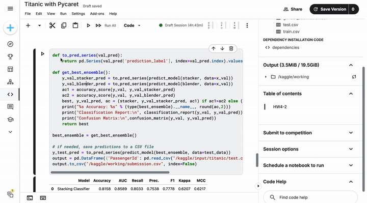

## AIoT Applications and Data Analysis

Course ID: 7716, CS, NCHU  
Nov., 2024

### HW4 - AutoML and Ensemble


#### Kaggle
[Titanic with PyCaret](https://www.kaggle.com/code/kzxiao/titanic-with-pycaret)

#### Library Dependencies
Install Python libraries
```bash
python -m pip install joblib==1.3.2 pycaret==3.0.4
```

#### Running
```bash
python main.py
```

#### Exercise
##### :speech_balloon: Step 1
###### :bulb: *Prompt*
make code in pycaret to solve the titanic classification problem as pick  a ensemble  model by accuracy between blend_mode and stack_model, please.

######  *ChatGPT:*
Here’s how you can use PyCaret to solve the Titanic classification problem and compare ensemble models using `blend_models` and `stack_models`, selecting the one with the highest accuracy.

```python
import numpy as np
import pandas as pd
from sklearn.model_selection import train_test_split
from sklearn.metrics import accuracy_score, classification_report, confusion_matrix
import matplotlib.pyplot as plt
from pycaret.classification import *

# load the dataset
train_data = pd.read_csv("data/train.csv", index_col='PassengerId')
test_data = pd.read_csv("data/test.csv", index_col='PassengerId')

def preprocess_data(combined_data):
    social_status_mapping = {'Capt': 'Rare', 'Col': 'Rare', 'Don': 'Rare', 'Dona': 'Rare', 'Dr': 'Rare', 'Jonkheer': 'Rare', 'Lady': 'Rare', 'Major': 'Rare', 'Mlle': 'Miss', 'Mme': 'Miss', 'Mrs':'Miss', 'Ms': 'Miss', 'Rev': 'Rare', 'Sir': 'Rare', 'the Countess': 'Rare'}
    
    # full data
    total_data = pd.concat(combined_data)
    head_count = pd.Series(total_data.groupby('Ticket')['Name'].count()).to_dict()

    total_data['Title'] = total_data['Name'].apply(lambda x: x.split(',')[1].split('.')[0].strip())
    age = total_data.groupby(['Title', 'Pclass'])['Age'].transform('median').fillna(total_data['Age'].median())
    combined_age = [age.iloc[:len(combined_data[0])], age.iloc[len(combined_data[0]):]]

    for data, age in zip(combined_data, combined_age):
        # imputing missing values
        data['Title'] = data['Name'].apply(lambda x: x.split(',')[1].split('.')[0].strip())
        data['AgeIsNull'] = np.where(data['Age'].isnull(), 1, 0)
        data['Age'] = np.where(data.Age.isnull(), age, data.Age)
        data['Fare'] = data['Fare'].fillna(data.Fare.median())
        data['CabinIsNull'] = np.where(data['Cabin'].isnull(), 1, 0)
        data['Cabin'] = data['Cabin'].fillna('NA')
        data['Embarked'] = data['Embarked'].fillna('S')
        data['Embarked'] = data['Embarked'].map({'S': 0, 'C': 1, 'Q': 2})

        # formating categorical features
        data['Title'] = data['Title'].replace(social_status_mapping)
        data['Sex'] = data['Sex'].replace({'female':0, 'male':1})
        data['TicketHeadCount'] = data['Ticket'].replace(head_count)

        # formating Numerical features
        data['AgeBin'] = pd.qcut(data['Age'], q=6, duplicates='drop', labels=False)
        data['FareBin'] = pd.qcut(data['Fare'], q=6, duplicates='drop', labels=False)
        data['IsAlone'] = np.where((data.Parch==0) & (data.SibSp==0), 1, 0)
        data['FamilyMember'] = data['SibSp'] + data['Parch'] + 1

combined_data = [train_data, test_data]
preprocess_data(combined_data)

# performing one hot encoding
train_data = pd.get_dummies(train_data,columns=["Title","Embarked",'AgeBin','FareBin'], prefix=["Title","Emb",'Age','Fare'])
test_data = pd.get_dummies(test_data,columns=["Title","Embarked",'AgeBin','FareBin'], prefix=["Title","Emb",'Age','Fare'])

# dropping unnecessary features
drop = ['Name', 'Age', 'Ticket', 'Fare', 'Cabin', 'Title_Miss', 'Sex', 'Parch', 'SibSp']
train_data = train_data.drop(drop, axis=1)
test_data = test_data.drop(drop, axis=1)

# selection features
x_train = train_data
y_train = train_data['Survived']
x_train, x_val, y_train, y_val = train_test_split(x_train, y_train, test_size = 0.17, random_state = 42)

clf1 = setup(data=x_train,
             target = 'Survived',
             categorical_features=['Title_Mr', 'Pclass', 'CabinIsNull', 'Fare_5', 'Age_2', 'IsAlone'])
top = compare_models(fold=3, n_select=16)

best = top[:1]
tuned_best = [tune_model(i, verbose=False, tuner_verbose=False) for i in best]
stacker = stack_models(estimator_list = tuned_best, meta_model = best[0], verbose=False)
blender = blend_models(tuned_best, verbose=False)

def to_pred_series(val_pred):
    return pd.Series(val_pred['prediction_label'], index=val_pred.index).values

def get_best_ensemble():
    y_val_stacker_pred = to_pred_series(predict_model(stacker, data=x_val))
    y_val_blender_pred = to_pred_series(predict_model(blender, data=x_val))
    ac1 = accuracy_score(y_val, y_val_stacker_pred)
    ac2 = accuracy_score(y_val, y_val_blender_pred)
    best, y_val_pred, ac = (stacker, y_val_stacker_pred, ac1) if ac1>ac2 else (blender, y_val_blender_pred, ac2)
    print("%s Accuracy: %s" % (type(best).__name__, round(ac,2)))
    print("Classification Report:\n", classification_report(y_val, y_val_pred))
    print("Confusion Matrix:\n",confusion_matrix(y_val, y_val_pred))
    return best
    
best_ensemble = get_best_ensemble()

# if needed, save predictions to a CSV file
y_test_pred = to_pred_series(predict_model(best_ensemble, data=test_data))
output = pd.DataFrame({'PassengerId': pd.read_csv("data/test.csv")["PassengerId"], 'Survived': y_test_pred})
output.to_csv("data/submission.csv", index=False)
```

**Key Steps in the Code:**
1. `setup`: Initializes the PyCaret environment, setting up the dataset and target variable.
2. `compare_models`: Identifies baseline models for comparison.
3. `blend_models` **and** `stack_models`: Implements ensemble techniques using the top 3 models.
4. **Evaluation**: Compares accuracy from blended and stacked models.
5. **Finalization**: Finalizes and saves the best model for deployment.

Make sure your Titanic dataset is preprocessed and ready for training (e.g., missing values handled, categorical features encoded). The `target='Survived'` assumes this is the target column in your dataset. Adjust according to your dataset structure.