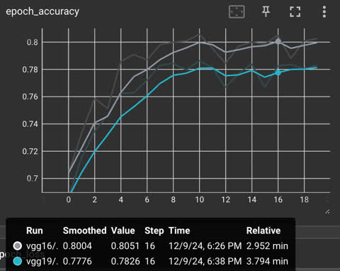

## AIoT Applications and Data Analysis

Course ID: 7716, CS, NCHU  
Dec., 2024

### HW5 - Deep Lerarning Basic
<br>Iris | <br>MNIST | <br>CIFAR-10
|:-:|:-:|:-:|


#### Library Dependencies
Install Python libraries
```bash
python -m pip install scikit-learn==1.2.2 tensorflow==2.13.1 pytorch-lightning==2.4.0 torchvision==0.17.2
```

#### Running
```bash
python main.py && python main2.py && python main3.py
```

#### Logging
The log files in `doscs/`.
```
tensorboard --logdir_spec=keras:logs/1/keras/validation,torch:logs/1/torch,lightning:logs/1/pl
```

```
tensorboard --logdir_spec=dense:logs/2/dense/validation,conv:logs/2/conv/validation
```

```
tensorboard --logdir_spec=vgg16:docs/logs/3/vgg16/validation,vgg19:docs/logs/3/vgg19/validation
```


#### Exercise
##### 5.1 - Iris classification problem in tf.keras, PyTorch and PyTorch Lightning
##### :speech_balloon: Step 1
###### :bulb: *Prompt*
solve iris classfication problem with early stopping, batch normalzation and dropout in keras, pytorch and pytorch lightnning, please.

######  *ChatGPT:*
Here is a complete implementation of the Iris classification problem using Keras, PyTorch, and PyTorch Lightning, incorporating early stopping, batch normalization, and dropout.

```python
import os
os.environ['TF_CPP_MIN_LOG_LEVEL'] = '1' 
import tensorflow as tf
import keras
import numpy as np
import torch
import torch.nn as nn
import torch.optim as optim
import pytorch_lightning as pl
import logging
logging.getLogger("pytorch_lightning").setLevel(logging.WARNING)
import warnings
warnings.filterwarnings("ignore", ".*does not have many workers.*")

import pandas as pd
from sklearn import datasets
from sklearn.model_selection import train_test_split
from sklearn.preprocessing import StandardScaler
from sklearn import metrics
from keras.callbacks import TensorBoard
from torch.utils.data import DataLoader, TensorDataset
from torch.utils.tensorboard import SummaryWriter

def load_iris():
    iris = datasets.load_iris();
    x = iris.data
    y = iris.target
    
    x_train, x_test, y_train, y_test = train_test_split(x,y,test_size=0.17,random_state=42)
    x_train, x_val, y_train, y_val = train_test_split(x_train,y_train,test_size=0.17,random_state=42)
    
    scaler = StandardScaler()
    x_train = scaler.fit_transform(x_train)
    x_val = scaler.transform(x_val)
    x_test = scaler.transform(x_test)
    return x_train, x_val, x_test, y_train, y_val, y_test

x_train, x_val, x_test, y_train, y_val, y_test = load_iris()

batch_size = 8
max_epochs = 20

def _keras():
    print("Keras:")
    num_classes = 3
    _y_train = tf.keras.utils.to_categorical(y_train, num_classes)
    _y_val = tf.keras.utils.to_categorical(y_val, num_classes)
    _y_test = tf.keras.utils.to_categorical(y_test, num_classes)
    model = tf.keras.Sequential([
        tf.keras.Input(shape=(x_train.shape[1],)),
        tf.keras.layers.Dense(16, activation='relu'),
        tf.keras.layers.BatchNormalization(),
        tf.keras.layers.Dropout(0.2),
        tf.keras.layers.Dense(8, activation='relu'),
        tf.keras.layers.BatchNormalization(),
        tf.keras.layers.Dropout(0.2),
        tf.keras.layers.Dense(num_classes, activation='softmax')
    ])
    model.compile(optimizer='adam', loss='categorical_crossentropy', metrics=['accuracy'])
    early_stopping = keras.callbacks.EarlyStopping(monitor='loss', patience=2, restore_best_weights=True, verbose=1)
    tbcb = TensorBoard(log_dir="logs/1/keras", histogram_freq=0)
    model.fit(x_train, _y_train, epochs=max_epochs, batch_size=batch_size,  validation_data=(x_val, _y_val), callbacks=[early_stopping, tbcb], verbose=0)
    test_loss, test_acc = model.evaluate(x_test, _y_test, verbose=1)
    print(f"Test accuracy: {test_acc}\n")

_keras()

x_train, x_val, x_test, y_train, y_val, y_test = load_iris()
x_train = torch.tensor(x_train, dtype=torch.float32)
x_val = torch.tensor(x_val, dtype=torch.float32)
x_test = torch.tensor(x_test, dtype=torch.float32)
y_train = torch.tensor(y_train, dtype=torch.long)
y_val = torch.tensor(y_val, dtype=torch.long)
y_test = torch.tensor(y_test, dtype=torch.long)

batch_size = 8
train_dataset = TensorDataset(x_train, y_train)
val_dataset = TensorDataset(x_val, y_val)
test_dataset = TensorDataset(x_test, y_test)
train_loader = DataLoader(train_dataset, batch_size=batch_size, shuffle=True)
val_loader = DataLoader(val_dataset, batch_size=batch_size, shuffle=False)
test_loader = DataLoader(test_dataset, batch_size=batch_size, shuffle=False)

def _torch():
    print("Torch:")
    device = torch.device('cuda' if torch.cuda.is_available() else 'cpu')
    print(f"using device: {device}")

    class IrisNet(nn.Module):
        def __init__(self):
            super(IrisNet, self).__init__()
            self.fc1 = nn.Linear(4, 16)
            self.bn1 = nn.BatchNorm1d(16)
            self.dropout1 = nn.Dropout(0.3)
            self.fc2 = nn.Linear(16, 8)
            self.bn2 = nn.BatchNorm1d(8)
            self.dropout2 = nn.Dropout(0.3)
            self.fc3 = nn.Linear(8, 3)
        
        def forward(self, x):
            x = self.dropout1(torch.relu(self.bn1(self.fc1(x))))
            x = self.dropout2(torch.relu(self.bn2(self.fc2(x))))
            x = self.fc3(x)
            return x

    model = IrisNet().to(device)

    criterion = nn.CrossEntropyLoss()
    optimizer = optim.Adam(model.parameters(), lr=0.01)
    writer = SummaryWriter(log_dir='logs/1/torch')

    # Early Stopping parameters
    patience = 2  
    best_val_loss = float('inf')  
    epochs_without_improvement = 0  
    best_model_state = None

    epochs = max_epochs
    for epoch in range(epochs):
        model.train()
        running_loss = 0.0
        for feature, labels in train_loader:
            feature, labels = feature.to(device), labels.to(device)
            outputs = model(feature)
            loss = criterion(outputs, labels)
            optimizer.zero_grad()
            loss.backward()
            optimizer.step()
            running_loss += loss.item()

        model.eval()
        val_loss = 0.0
        correct = 0
        total = 0
        with torch.no_grad():
            for feature, labels in val_loader:
                feature, labels = feature.to(device), labels.to(device)
                outputs = model(feature)
                loss = criterion(outputs, labels)
                val_loss += loss.item()

                _, predicted = torch.max(outputs, 1)
                total += labels.size(0)
                correct += (predicted == labels).sum().item()
        
        val_accuracy = correct / total
        writer.add_scalar('epoch_loss', val_loss / len(val_loader), epoch)
        writer.add_scalar('epoch_accuracy', val_accuracy, epoch)

        # Early stopping check
        if val_loss < best_val_loss:
            best_val_loss = val_loss
            epochs_without_improvement = 0
            # Save the best model
            best_model_state = model.state_dict()
        else:
            epochs_without_improvement += 1
            if epochs_without_improvement >= patience:
                print(f"Early stopping triggered at epoch {epoch+1}")
                break
    
    if best_model_state is not None:
        model.load_state_dict(best_model_state)

    model.eval()
    correct = 0
    total = 0
    with torch.no_grad():
        for feature, labels in test_loader:
            feature, labels = feature.to(device), labels.to(device)
            outputs = model(feature)
            _, predicted = torch.max(outputs, 1)
            total += labels.size(0)
            correct += (predicted == labels).sum().item()

    accuracy = correct / total
    print(f"Test Accuracy: {accuracy:.4f}")

_torch()


def _pl():
    print("Lightning:")
    writer = SummaryWriter(log_dir='logs/1/pl')
    
    class IrisClassifier(pl.LightningModule):

        def __init__(self, input_size=4, 
                    hidden_size1=16,
                    hidden_size2=8,
                    output_size=3,
                    lr=0.01):
            super(IrisClassifier, self).__init__()
            self.model = nn.Sequential(
                nn.Linear(input_size, hidden_size1),
                nn.BatchNorm1d(hidden_size1),
                nn.ReLU(),
                nn.Dropout(0.2),
                nn.Linear(hidden_size1, hidden_size2),
                nn.BatchNorm1d(hidden_size2),
                nn.ReLU(),
                nn.Dropout(0.2),
                nn.Linear(hidden_size2, output_size)
            )
            self.criterion = nn.CrossEntropyLoss()
            self.lr = lr
            self.test_acc = []
            self.val_acc = []
            self.val_loss = []
        
        def forward(self, x):
            return self.model(x)
        
        def training_step(self, batch, batch_idx):
            x, y = batch
            y_hat = self(x)
            loss = self.criterion(y_hat, y)
            # self.log("loss/train", loss)
            return loss
        
        def validation_step(self, batch, batch_idx):
            loss, acc = self.validate(batch)
            self.val_acc += [acc.cpu().numpy()]
            self.val_loss += [loss.cpu().numpy()]
            self.log("val_loss", loss, prog_bar=False)

        @torch.no_grad()
        def validate(self, batch):
            x, y = batch
            y_hat = self.forward(x)
            loss = self.criterion(y_hat, y)
            acc = (y_hat.argmax(dim=1)==y).float().mean()
            return loss, acc

        def test_step(self, batch, batch_idx):
            loss, acc = self.validate(batch)
            self.test_acc += [acc.cpu().numpy()]
        
        def configure_optimizers(self):
            return torch.optim.Adam(self.parameters(), lr=self.lr)

        def evaluate(self):
            return np.array(self.test_acc).mean()
        
        def on_validation_epoch_end(self):
            writer.add_scalar('epoch_loss', np.array(self.val_loss).mean(), self.current_epoch)
            writer.add_scalar('epoch_accuracy', np.array(self.val_acc).mean(), self.current_epoch)
            self.val_loss.clear()
            self.val_acc.clear()
    
    model = IrisClassifier()
    early_stopping = pl.callbacks.EarlyStopping(monitor="val_loss", patience=2, verbose=True, mode="min")
    trainer = pl.Trainer(max_epochs=max_epochs, log_every_n_steps=10, callbacks=[early_stopping], enable_progress_bar=False)
    trainer.fit(model, train_dataloaders=train_loader, val_dataloaders=val_loader)
    trainer.test(model, dataloaders=test_loader, verbose=False)
    acc = model.evaluate()
    print(f"Lightning Test Accuracy: {acc:.4f}")

_pl()
```

This implementation follows the same design principles in all three frameworks, ensuring comparability. Each method incorporates early stopping, batch normalization, and dropout.

----

##### 5.2 - MNIST classification problem in dense and convolutional
##### :speech_balloon: Step 1
###### :bulb: *Prompt*
solve mnist classification problem with early stopping, batch normalzation and dropout dense and convolutional, please.

######  *ChatGPT:*
Here’s the Python script:
```python
import os
os.environ['TF_CPP_MIN_LOG_LEVEL'] = '1' 

import tensorflow as tf
from sklearn.model_selection import train_test_split
from tf.keras.datasets import mnist
from tf.keras.utils import to_categorical
from tf.keras.models import Sequential
from tf.keras.layers import Flatten, Dense, BatchNormalization, Dropout, Conv2D, MaxPooling2D
from keras.callbacks import TensorBoard, EarlyStopping

(x_train, y_train), (x_test, y_test) = mnist.load_data()
x_train, x_val, y_train, y_val = train_test_split(x_train,y_train,test_size=0.17,random_state=42)

x_train = x_train.reshape(-1, 28, 28, 1).astype('float32') / 255.0
x_val = x_val.reshape(-1, 28, 28, 1).astype('float32') / 255.0
x_test = x_test.reshape(-1, 28, 28, 1).astype('float32') / 255.0
y_train = to_categorical(y_train, 10)
y_val = to_categorical(y_val, 10)
y_test = to_categorical(y_test, 10)

batch_size = 32
max_epochs = 2

def _fit(model, log_dir):
    early_stopping = EarlyStopping(monitor='loss', patience=2, restore_best_weights=True, verbose=1)
    tbcb = TensorBoard(log_dir=f"2_logs/{log_dir}", histogram_freq=0)
    model.compile(optimizer='adam', loss='categorical_crossentropy', metrics=['accuracy'] )
    model.fit(x_train, y_train, validation_data=(x_val, y_val), epochs=max_epochs, batch_size=batch_size, callbacks=[early_stopping, tbcb])
    loss, accuracy = model.evaluate(x_test, y_test)
    print(f"Test Accuracy: {accuracy:.4f}")

def _dense():
    model = Sequential([
        tf.keras.Input(shape=(28, 28, 1)),
        Flatten(),
        Dense(128, activation='relu'),
        BatchNormalization(),
        Dropout(0.2),
        Dense(64, activation='relu'),
        BatchNormalization(),
        Dropout(0.2),
        Dense(10, activation='softmax')
    ])
    return model

def _conv():
    model = Sequential([
        tf.keras.Input(shape=(28, 28, 1)),
        Conv2D(32, kernel_size=(3, 3), activation='relu'),
        BatchNormalization(),
        MaxPooling2D(pool_size=(2, 2)),
        Dropout(0.2),
        Conv2D(64, kernel_size=(3, 3), activation='relu'),
        BatchNormalization(),
        MaxPooling2D(pool_size=(2, 2)),
        Dropout(0.2),
        Flatten(),
        Dense(128, activation='relu'),
        Dense(10, activation='softmax')
    ])
    return model

_fit(_dense(), "dense")
_fit(_conv(), "conv")
```

**Key Features:**

**1. Data Preparation:**
  - Normalization and reshaping for compatibility with Keras layers.
  - One-hot encoding for classification labels.

**2. Model Architectures:**
  - Dense model with fully connected layers, dropout, and batch normalization.
  - Convolutional model with Conv2D, max pooling, dropout, and batch normalization.

**3. Callbacks:**
  - Early stopping prevents overfitting by halting training when the loss does not improve.
  - TensorBoard logging allows visualization of training metrics.

**4. Training and Evaluation:**
  - Both models are trained and evaluated separately, with test accuracy printed for each.


  ----

##### 5.3 - CIFAR10 in VGG16 and VGG19
##### :speech_balloon: Step 1
###### :bulb: *Prompt*
solve cifar10 classification problem in pretrained models of vgg16 and vgg19 with keras, please.

######  *ChatGPT:*
Here's a Python script implementing your requirements:
```python
import tensorflow as tf
import keras
from sklearn.model_selection import train_test_split

num_classes = 10
def load_cifar10():
    (x_train, y_train), (x_test, y_test) = tf.keras.datasets.cifar10.load_data()
    x_train = x_train.astype('float32') / 255
    x_test = x_test.astype('float32') / 255
    y_train = tf.keras.utils.to_categorical(y_train, num_classes=num_classes)
    y_test = tf.keras.utils.to_categorical(y_test, num_classes=num_classes)
    x_train, x_val, y_train, y_val = train_test_split(x_train, y_train, test_size=0.17)
    return x_train, x_val, y_train, y_val, x_test, y_test
    
x_train, x_val, y_train, y_val, x_test, y_test = load_cifar10()
max_epochs = 20
batch_size = 64

def load_model(model_name):
    vgg, l = (tf.keras.applications.vgg19.VGG19, -10) if model_name == 'vgg19' else (tf.keras.applications.vgg16.VGG16, -8)
    model = vgg(weights='imagenet', include_top=False, classes=10, input_shape=(32,32,3))
    for layer in model.layers[:l]:
        layer.trainable = False
    x = tf.keras.layers.Flatten()(model.output)
    x = tf.keras.layers.Dense(512, activation='relu')(x)
    x = tf.keras.layers.Dropout(0.5)(x)
    x = tf.keras.layers.Dense(256, activation='relu')(x)
    x = tf.keras.layers.Dropout(0.5)(x)
    x = tf.keras.layers.Dense(num_classes, activation='softmax')(x)
    model = tf.keras.models.Model(inputs=model.input, outputs=x)
    return model
    
def _fit(model_name):
    print(f'{model_name}:')
    model = load_model(model_name)
    early_stopping = keras.callbacks.EarlyStopping(monitor='loss', patience=2, restore_best_weights=True, verbose=1)
    tbcb = keras.callbacks.TensorBoard(log_dir=f"logs/3/{model_name}", histogram_freq=0)
    model.compile(loss='categorical_crossentropy',optimizer=tf.keras.optimizers.SGD(learning_rate=0.001, momentum=0.9) ,metrics=['accuracy'])
    model.fit(x_train, y_train, validation_data=(x_val, y_val), epochs=max_epochs, batch_size=batch_size, callbacks=[early_stopping, tbcb], verbose=1)
    loss, accuracy = model.evaluate(x_test, y_test, verbose=0)
    print(f"Test Accuracy: {accuracy:.4f}")


_fit("vgg16")
_fit("vgg19")
```

This script fulfills all the requirements specified. It uses Keras for training and evaluation, employs pre-trained VGG models, and properly handles dataset loading, logging, and evaluation.