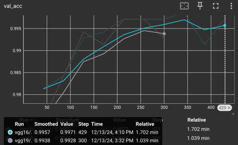
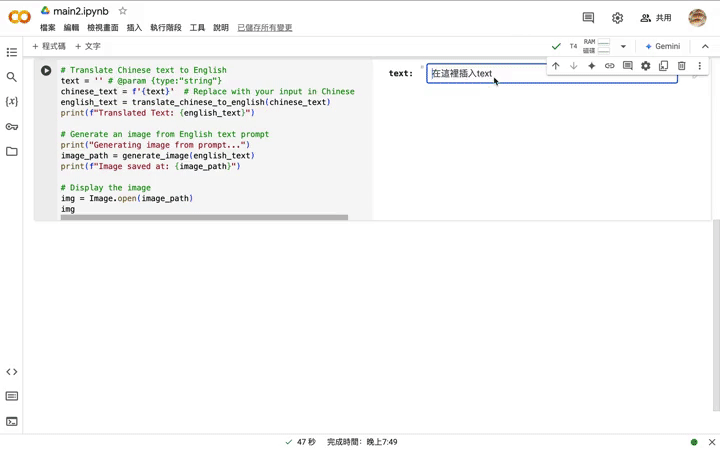

## AIoT Applications and Data Analysis

Course ID: 7716, CS, NCHU  
Dec., 2024

### HW6 - Transfer Learning and Hugging Face
  




#### Library Dependencies
Install Python libraries
```bash
python -m pip install numpy pytorch-lightning==2.4.0 torchvision==0.17.2 diffusers transformers sacremoses
```

#### Running
```bash
python main.py
```
```bash
python main2.py
```

#### Logging
The log files in `doscs/`.
```
%tensorboard --logdir_spec=vgg16:logs/1/vgg16/version_0,vgg19:logs/1/vgg19/version_0
```


#### Exercise
##### 6.1 - The face mask classification problem in PyTorch Lightning
##### :speech_balloon: Step 1
###### :bulb: *Prompt*
solve the face mask classification problem in pytorch lightning. using vgg16 and vgg19, following crisp-dm.
use pre-trained model and freezing its early layers, change classifier for 2 outpus classes.
momentum, early stopping and model checkpointing.

######  *ChatGPT:*
```python
import torch
import torch.nn as nn
import pytorch_lightning as pl
import logging
logging.getLogger("pytorch_lightning").setLevel(logging.WARNING)
import torchvision
import numpy as np
import matplotlib.pyplot as plt
from torch.utils.data import Subset
from torchvision import datasets, transforms
from torchvision.models import vgg16, vgg19
from torchsummary import summary
import warnings
warnings.filterwarnings("ignore", ".*Palette images with Transparency.*")

transform = transforms.Compose([
    transforms.Resize((64,64)),
    transforms.ToTensor(),
])

train_transform = transforms.Compose([
    transforms.Resize((64,64)),
    transforms.RandomHorizontalFlip(),
    transforms.RandomRotation(30),
    transform
])

dataset_path = "Face-Mask-Detection/dataset"
train_dataset = datasets.ImageFolder(dataset_path, transform=train_transform)
dataset = datasets.ImageFolder(dataset_path, transform=transform)

def load_data():
    # use different transform, instead of train, val, test = torch.utils.data.random_split(dataset, [l, r, r]).
    l=len(dataset) 
    indices = list(range(l))
    r = (int)(l*0.17)
    l -= r<<1
    r += l
    
    np.random.shuffle(indices)
    train_idx, val_idx, test_idx = indices[:l], indices[l:r], indices[r:]
    # print(f'[{l}], [{l}:{r}], [{r}:]')

    train = Subset(train_dataset, indices=train_idx)
    val = Subset(dataset, indices=val_idx)
    test = Subset(dataset, indices=test_idx)

    batch_size = 64
    num_workers = 2
    train_loader = torch.utils.data.DataLoader(train, batch_size=batch_size, num_workers=num_workers, shuffle=True)
    val_loader = torch.utils.data.DataLoader(val, batch_size=batch_size, num_workers=num_workers)
    test_loader = torch.utils.data.DataLoader(test, batch_size=batch_size, num_workers=num_workers)
    return train_loader, val_loader, test_loader

train_loader, val_loader, test_loader = load_data()
print(f'train: {len(train_loader.dataset)}, valid: {len(val_loader.dataset)}, test: {len(test_loader.dataset)}')

def load_model(name):
    model, l = (vgg19(weights=torchvision.models.VGG19_Weights.IMAGENET1K_V1), -9) if name == 'vgg19' else (vgg16(weights=torchvision.models.VGG16_Weights.IMAGENET1K_V1), -7)
    for p in model.features[:l]: p.require_grad = False
    in_features = model.classifier[0].out_features
    model.classifier[-4] = nn.Linear(in_features, 512)
    model.classifier[-1] = nn.Linear(512, 2)    
    # for i, m in enumerate(model.children()): 
    #     if i==2: print(f'{i}. {m}')
    return model


class FaceMaskClassifier(pl.LightningModule):
    def __init__(self, model_name="vgg19", num_classes=2, lr=1e-3):
        super().__init__()
        self.lr = lr
        self.model = load_model(model_name)
        self.criterion = nn.CrossEntropyLoss()
        self.test_acc = []
        
    def forward(self, x):
        return self.model(x)
    
    def training_step(self, batch, batch_idx):
        x, y = batch
        y_hat = self(x)
        loss = self.criterion(y_hat, y)
        return loss
    
    def validation_step(self, batch, batch_idx):
        loss, acc = self.validate(batch)
        self.log("val_loss", loss, prog_bar=True)
        self.log("val_acc", acc, prog_bar=True)
        return loss
 
    @torch.no_grad()
    def validate(self, batch):
        x, y = batch
        y_hat = self(x)
        loss = self.criterion(y_hat, y)
        acc = (y_hat.argmax(dim=1)==y).float().mean()
        return loss, acc

    def test_step(self, batch, batch_idx):
        loss, acc = self.validate(batch)
        self.test_acc += [acc.cpu().numpy()]
        return loss, acc
    
    def configure_optimizers(self):
        optimizer = torch.optim.SGD(self.parameters(), lr=0.01, momentum=0.9)
        scheduler = torch.optim.lr_scheduler.ReduceLROnPlateau(optimizer,mode="min",factor=0.1,patience=3,verbose=True)
        return {"optimizer": optimizer,"lr_scheduler": {"scheduler": scheduler, "monitor": "val_loss", "frequency": 1, "strict": True}}
    
    def evaluate(self):
        return np.array(self.test_acc).mean()
        
def _fit(model_name):
    print(f"{model_name}:")
    max_epochs = 20
    mcp = pl.callbacks.ModelCheckpoint(monitor="val_loss", dirpath=f"checkpoints/{model_name}", save_top_k=1, mode="min")
    es = pl.callbacks.EarlyStopping(monitor="val_loss", patience=2, verbose=True, mode="min")
    rpb = pl.callbacks.RichProgressBar()
    tb = pl.loggers.TensorBoardLogger(save_dir=f"logs/1/{model_name}", name=None)
    model = FaceMaskClassifier(model_name=model_name, num_classes=2, lr=1e-3)
    trainer = pl.Trainer(max_epochs=max_epochs,log_every_n_steps=10, logger=tb, callbacks=[rpb, es, mcp])
    trainer.fit(model, train_loader, val_loader)
    trainer.test(model, dataloaders=test_loader)
    acc = model.evaluate()
    print(f"Test Accuracy: {acc:.4f}")
    return model

def main():
    _fit('vgg19')
    _fit('vgg16')

if __name__ == '__main__':
    main()
```

The code follows CRISP-DM principles:

**1. Business Understanding:** Solve face mask detection using pre-trained VGG models.
**2. Data Understanding:** Loads dataset from ImageFolder, applies augmentation, and splits data.
**3. Data Preparation:** Normalizes images and splits dataset into train, validation, and test subsets.
**4. Modeling:** Uses VGG16 and VGG19 with frozen early layers and modified classifier layers.
**5. Evaluation:** Includes validation loss, accuracy logging, and test accuracy evaluation.
**6. Deployment:** Saves best model checkpoints and logs results for analysis.

----
##### 6.2 - Text to image with Hugging Face.
##### :speech_balloon: Step 1
###### :bulb: *Prompt*
write hugging face to do:
1. allow user to input chinese sentence, translate this to english.
2. based on this english sentence generate an image.


######  *ChatGPT:*
Here's a Colab-compatible Python script to achieve text-to-image generation using a Hugging Face model and enable translating Taiwanese to English using Hugging Face's translation models.
```python
import torch
from PIL import Image
from transformers import AutoTokenizer, AutoModelForSeq2SeqLM
from diffusers import StableDiffusionPipeline

def translate_chinese_to_english(text, model_name="Helsinki-NLP/opus-mt-zh-en"):
    tokenizer = AutoTokenizer.from_pretrained(model_name)
    model = AutoModelForSeq2SeqLM.from_pretrained(model_name)
    inputs = tokenizer.encode(text, return_tensors="pt", max_length=512, truncation=True)
    outputs = model.generate(inputs, max_length=512, num_beams=4, early_stopping=True)
    translated_text = tokenizer.decode(outputs[0], skip_special_tokens=True)
    return translated_text

def generate_image(prompt, model_name="CompVis/stable-diffusion-v1-4", output_path="generated_image.png"):
    device = "cuda" if torch.cuda.is_available() else "cpu"
    pipe = StableDiffusionPipeline.from_pretrained(model_name)
    pipe = pipe.to(device)
    image = pipe(prompt).images[0]  # Get the first generated image
    image.save(output_path)
    return output_path

if __name__ == "__main__":
    text = '一隻小狗在大安森林公園湖邊戲水' # @param {type:"string"}
    chinese_text = f'{text}'  # Replace with your input in Chinese
    english_text = translate_chinese_to_english(chinese_text)
    print(f"Translated Text: {english_text}")

    print("Generating image from prompt...")
    image_path = generate_image(english_text)
    print(f"Image saved at: {image_path}")

    img = Image.open(image_path)
    img
```
This script uses the Hugging Face `transformers` library for translation and the `diffusers` library for generating images using a stable diffusion model. You can adjust the model names and input text as needed.

To use this script in Google Colab:

1. Upload the script to your Colab environment or copy-paste it into a Colab cell.
2. Install the required libraries if they're not already installed.
3. Replace `chinese_text` with your input and run the script.

Let me know if you need additional setup instructions!